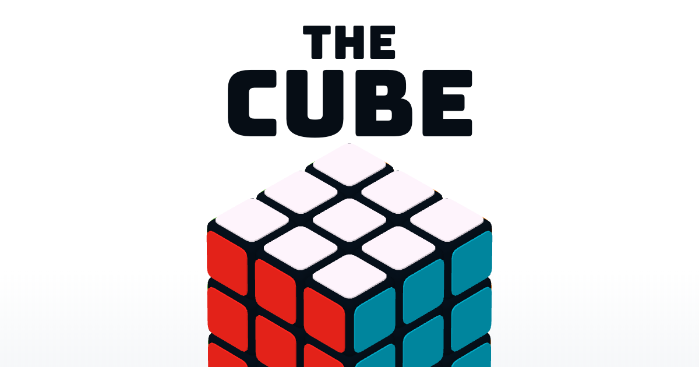

The Cube

Your next personal best starts with one turn.

A 3D Rubik’s Cube game with custom colours, smooth motion, and saved solve records.

 

  

Features

<table>
<tr>
<td width="33%" align="center"><h3>🧩 Pick your challenge</h3><strong>2×2 · 3×3 · 4×4 · 5×5</strong>
Four sizes, with adjustable scrambling.
</td>
<td width="33%" align="center"><h3>🎨 Make it yours</h3><strong>Five colour presets</strong>
Fine-tune hue, saturation, and lightness.
</td>
<td width="33%" align="center"><h3>⏱ Chase your best</h3><strong>Timer + solve history</strong>
Track records and recent averages.
</td>
</tr>
<tr>
<td align="center"><h3>✨ Feel every turn</h3><strong>Swift · Smooth · Bounce</strong>
Three animations and an adjustable camera.
</td>
<td align="center"><h3>💾 Keep your progress</h3><strong>Saved in your browser</strong>
Resume your puzzle with saved preferences.
</td>
<td align="center"><h3>🎉 Finish in style</h3><strong>A colourful celebration</strong>
Complete the cube and aim for a new record.
</td>
</tr>
</table>

<strong>See the complete feature list</strong>

Feature

Description

Interactive 3D cube

Drag-based controls for turning layers and rotating the cube

Four cube sizes

Choose 2×2×2, 3×3×3, 4×4×4, or 5×5×5

Scrambling

Three scramble-length settings, with lengths varying by cube size

Flip animations

Swift, Smooth, and Bounce styles

Adjustable camera

Change the view between an orthographic-like appearance and a stronger perspective

Colour schemes

Cube, Erno, Dust, Camo, and Rain presets

Theme editor

Adjust hue, saturation, and lightness

Solve timer

Track the duration of each solve

Statistics

Total solves, best time, worst time, and averages over 5, 12, and 25 solves

Local persistence

Store preferences, scores, and an in-progress game using browser localStorage

Completion effects

Animated celebration and best-time feedback

Mouse and touch input

Controls implemented for desktop and touch interaction

Statistics are recorded separately for each cube size. The displayed averages are arithmetic means of the most recent solves, rather than competition-style trimmed averages.

Quick start

From the folder containing index.html, start a static server:

# Windows — Python 3 required
py -m http.server 8000

# macOS / Linux — Python 3 required
python3 -m http.server 8000

Open localhost:8000 in a WebGL-capable browser, then double-click or double-tap to start. No npm installation is needed to serve the included bundle.

[!IMPORTANT]
The supplied version has missing offline-support files and an incomplete legacy build script. Expand Known limitations below for the fixes; offline mode is not ready in this archive.

Play your way

01 · CUSTOMISE

02 · TURN

03 · SOLVE

Choose a size, theme, and scramble length.

Drag a face to turn a layer; drag outside the cube to rotate it.

Match each face to one colour and check your time.

CHOOSE YOUR PALETTE

Five built-in presets, plus your own colour adjustments. Badge colours are decorative.

Behind the cube

Everything you need to explore, customise, or contribute—expand a section below.

<strong>Technology</strong>

Layer

Technology

Page structure

HTML5

Styling

Compiled CSS with Sass source

Game logic

Vanilla JavaScript, organised into modules

3D rendering

Bundled Three.js and WebGL

Persistence

Browser localStorage

JavaScript bundling

Rollup configuration files

Build minification

rollup-plugin-babel-minify

No backend, database, API key, or account is required for the core game.

<strong>Project structure</strong>

Path

Purpose

index.html

Main page, interface markup, metadata, and script loading

assets/css/styles.css

Compiled application styles

assets/js/three.js

Bundled Three.js library

assets/js/cube.js

Compiled game code loaded by the page

assets/icons/

Favicons, application icons, preview images, and manifest

src/js/Game.js

Main application entry point and game coordination

src/js/Cube.js

Cube creation and state

src/js/Controls.js

Cube interaction and rotation logic

src/js/World.js

3D scene, camera, and renderer

src/js/Scrambler.js

Scramble generation

src/js/Timer.js

Solve timing

src/js/Scores.js

Solve records and statistics

src/js/Storage.js

Browser persistence

src/js/Preferences.js

Settings controls

src/js/Themes.js

Colour presets

src/js/ThemeEditor.js

Colour customisation

src/js/Confetti.js

Completion celebration

src/js/plugins/

Custom rounded geometry helpers

src/scss/

Sass styling source

rollup.config.dev.js

Development JavaScript bundle configuration

rollup.config.build.js

Minified JavaScript bundle configuration

package.json

Legacy package metadata and scripts

<strong>Development notes</strong>

The browser loads assets/js/cube.js, not the individual modules inside src/js/. Source changes therefore need to be bundled before they appear in the game.
Likewise, changes in src/scss/ must be compiled to assets/css/styles.css.
The supplied development Rollup configuration uses src/js/Game.js as its entry point and outputs an immediately invoked bundle to assets/js/cube.js. The production configuration adds minification.

Existing npm scripts

Command

Status in the supplied project

npm start

No start script is defined

npm run dev

No dev script is defined

npm run build

Legacy script; requires repairs before use

npm test

Placeholder that deliberately exits with an error

Running the existing compiled application does not require npm install.

<strong>Static hosting</strong>

The runtime application consists of index.html and the assets/ directory. Serve these together from the same root, preserving their relative paths.
Before publishing:

Address the missing offline-support scripts described below.

Update the original site URL and social-preview metadata in index.html for your deployment.

Remove or replace the original Google Analytics snippet with your own configuration, if analytics are wanted.

Preserve the original author credit and clarify any modifications you make.

No server-side runtime or environment variables are needed for the core game. Do not rely on the existing npm build command as a deployment step until it has been repaired.

<strong>Known limitations</strong>

Missing offline-support files

index.html requests upup.min.js, but that file is absent from the supplied archive. The build script also expects upup.sw.min.js, which is absent.
The check if (UpUp !== null) does not safely handle an undeclared variable and can produce ReferenceError: UpUp is not defined.
For an online-only version, remove the upup.min.js script tag and its associated UpUp.start(...) block. To retain offline support, restore the compatible UpUp assets and verify the caching setup. Offline operation is not complete in this archive.

Incomplete legacy build setup

The build script invokes rollup, but Rollup itself is not declared in the supplied development dependencies. It then copies the missing UpUp files into export/ and assumes the output directory exists. Its Unix-style cp commands are also not portable to a default Windows command shell.
Repair the dependencies, output-directory creation, and asset-copy steps before using this script. The committed assets/ files provide a separate way to run the existing game without rebuilding.

Keyboard controls

Keyboard-related source files exist, but the keyboard import in Game.js is commented out. Keyboard gameplay should not be treated as an enabled feature of this version.

Local storage

Clearing browser site data removes saved preferences, scores, and progress. Changing browser, device, hostname, or port uses a different storage context. A game-version change can also reset saved game state and preferences.

Score history typo

Scores.js uses data.scores.lenght instead of data.scores.length in the intended score-history limit check. The intended cap of 100 saved times therefore is not enforced by that code.

<strong>Troubleshooting</strong>

Problem

What to check

Blank page or missing cube

Inspect browser console errors, WebGL availability, and requests for the bundled scripts

Missing styles or icons

Serve the folder containing index.html and preserve the assets/ paths

UpUp is not defined

Remove the unused offline block or restore its missing dependencies

Missing script: start

Use a static server; this project has no npm start script

Build fails

Review the incomplete build setup above

Source edits do not appear

Rebuild the relevant JavaScript or stylesheet, then refresh

Saved records seem missing

Use the same browser and site address, and check whether site data was cleared

<strong>Contributing</strong>

Bug reports, documentation improvements, and focused pull requests are welcome.

Check existing issues and pull requests for related work.

For a bug, include your browser, device, cube size, reproduction steps, and any console error.

For a change, create a branch and keep the pull request focused on one improvement.

Explain what changed and how you checked it. Include before-and-after images for visual updates.

Good starting points include the score-history typo, the missing offline assets, and the legacy build setup described above.

<strong>Ideas for future improvements</strong>

These are proposed improvements, not current features or delivery promises.

Repair and document the JavaScript and Sass build workflow.

Restore or remove incomplete offline support.

Add and verify keyboard controls.

Improve accessibility and reduced-motion support.

Add move counting and optional sound controls.

Export and import local solve statistics.

<strong>Validation scope</strong>

This README is based on inspection of the supplied project source and package configuration. It does not claim that browser compatibility, gameplay, deployment, or a repaired build pipeline has been tested.

Support the project

Enjoyed the challenge?

⭐ Star the repository · Share the game · Help improve it

Small contributions make a difference: a clear bug report, a documentation fix, or a thoughtful feature idea.

Personal support link coming soon.

<!-- When your Buy Me a Coffee profile is ready, wrap the badge in an
     <a href="YOUR_ACTUAL_PROFILE_URL">...</a> link and remove the coming-soon text. -->

<strong>Credits and licence</strong>

The supplied HTML identifies Boris Sehovac as the original author. Its metadata references the original bsehovac GitHub project.
package.json declares ISC, but the supplied archive does not contain a standalone licence file. Preserve existing attribution and confirm the applicable upstream licence text before redistributing the project. Bundled third-party components may have their own licence notices.

Customised by SULAKSHAN M · Original game by Boris Sehovac

↑ Back to top

<!-- Presentation assets: Capsule Render, Readme Typing SVG, and Shields.io.
     These hosted graphics require network access. The project artwork paths
     assume this README sits beside index.html in the repository root. -->
